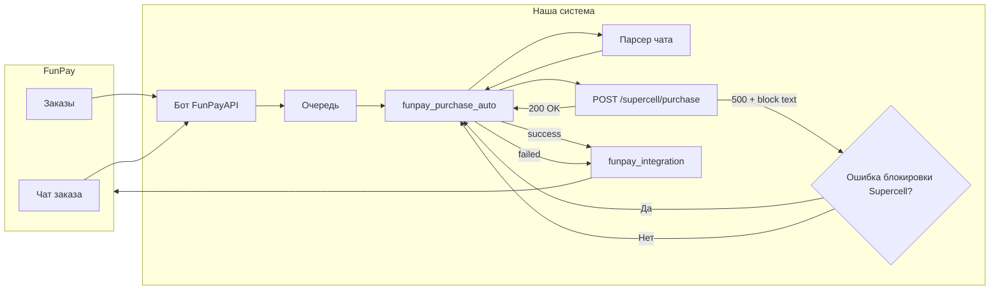

# Интеграция с FunPay и автономный скрипт покупки

## Контекст

- В проекте уже есть заготовка: [app/integrations/funpay.py](app/integrations/funpay.py) (get_order, update_order_status) и конфиг `FUNPAY_API_KEY`, `FUNPAY_API_URL`. Официального REST API у FunPay для продавцов нет; реальная работа с заказами и чатами — через неофициальные решения (например, FunPayAPI) или парсинг.
- Покупка в Supercell: [app/api/store_routes.py](app/api/store_routes.py) — эндпоинт `POST /supercell/purchase` (PurchaseRequest): `email`, `game`, `product_name`, `product_type`, `verification_code`, `email_password`. Демо: [examples/purchase_demo.py](examples/purchase_demo.py).
- Воркер [app/workers/arq_worker.py](app/workers/arq_worker.py) при `source=funpay` уже вызывает `funpay_integration.update_order_status`.

---

## 1. Интеграция с FunPay — пункты и подпункты

### 1.1 Получение заказов и чатов

- Вариант A: отдельный процесс (бот) на базе FunPayAPI — подписка на события (NEW_ORDER, NEW_MESSAGE), при новом заказе — отправка данных в наш API (webhook или очередь Redis).
- Вариант B: наш сервис периодически опрашивает FunPay через неофициальный API или парсинг.
- Расширение [app/integrations/funpay.py](app/integrations/funpay.py): метод получения заказа с чатом (order_id, текст заказа, список сообщений чата).

### 1.2 Парсинг данных из чата и заказа

- Определение игры и товара по названию лота/описанию (правила или AI).
- Извлечение email из чата (regex / AI).
- Извлечение OTP из чата (6-значный код); при отсутствии — использование `email_password` и EmailCodeReader.
- Единый парсер: на вход — заказ + сообщения чата; на выход — `email`, `verification_code`, `email_password`, `game`, `product_name`, `product_type`.

### 1.3 Связь с API покупки и воркером

- Формат данных для `POST /supercell/purchase` и вызов `funpay_integration.update_order_status` после успеха/ошибки.
- Endpoint или очередь Redis для постановки заказов FunPay в обработку.

### 1.4 Конфигурация и безопасность

- Хранение учётных данных FunPay в .env; не логировать и не сохранять в пруфах `email_password`.

---

## 2. Автономный скрипт (по примеру purchase_demo.py)

- Файл: `examples/funpay_purchase_auto.py`.
- Цикл: получить заказ FunPay → парсинг чата (email, OTP, game, product) → вызов `POST /supercell/purchase` → обновление статуса в FunPay.
- Краевые случаи: нет email в чате — пометить заказ failed; OTP не в чате — передавать `email_password`; таймаут/ошибка — статус failed и продолжение.

---

## 3. Обработка ошибок блокировки Supercell (перезапуск до успешной авторизации)

### 3.1 Ошибки, при которых скрипт перезапускается и повторяет попытки

При ответе API (500 или тело с `detail.error`) с текстом, содержащим любую из перечисленных фраз, считать это **блокировкой Supercell** и не завершать заказ ошибкой, а перезапускать попытку входа до успешной авторизации:

| Текст ошибки (или ключевые фразы) | Описание |

|-----------------------------------|----------|

| `Supercell заблокировал доступ на главной странице.` | Блокировка на главной (IP/автоматизация). |

| `Supercell ID вернул ошибку «Something went wrong. Please try again later.»` | Ошибка Supercell ID, нужен другой IP. |

| `Supercell заблокировал вход (unusual activity) на шаге ввода email.` | Блокировка на шаге email. |

| `Supercell заблокировал вход из-за обнаружения автоматизации.` | Детект автоматизации. |

Дополнительно учитывать варианты формулировок в коде (см. [app/api/store_routes.py](app/api/store_routes.py) и [app/api/supercell_auth_routes.py](app/api/supercell_auth_routes.py)): `"unusual activity"`, `"blocked"`, `"blocked your login"`, `"something went wrong"`, `"try again later"`.

### 3.2 Поведение скрипта при этих ошибках

- **Не** помечать заказ FunPay как окончательно failed.
- **Перезапустить** скрипт (или внутренний цикл попыток для текущего заказа): закрыть текущую сессию, при следующей итерации снова вызвать `POST /supercell/purchase` с теми же данными (email, game, product_name, verification_code/email_password).
- Повторять **до тех пор, пока авторизация не пройдёт** (успешный ответ 200 от `/supercell/purchase`), либо до достижения лимита попыток/перезапусков (например, 30–50 раз), после чего можно пометить заказ как failed и перейти к следующему.

### 3.3 Реализация в автономном скрипте

- После каждого вызова `POST /supercell/purchase`:
  - При **200** — считать авторизацию и покупку успешными: обновить статус заказа в FunPay, перейти к следующему заказу.
  - При **500** (или другой код с телом ошибки): извлечь `detail.error` (или аналог) и проверить по списку фраз блокировки выше.
    - Если совпадение — **не** вызывать `update_order_status(..., "failed")`; залогировать «Блокировка Supercell, перезапуск попытки»; увеличить счётчик попыток; повторить вызов `POST /supercell/purchase` для того же заказа (или перезапуск скрипта с тем же заказом в начале очереди).
    - Если фраз блокировки нет — считать ошибку окончательной: обновить статус заказа в FunPay как failed, перейти к следующему заказу.
- На стороне API уже есть retry с новым прокси ([store_routes.py](app/api/store_routes.py), `MAX_BLOCK_RETRIES = 30`): при блокировке помечается прокси и повторяется попытка. Скрипт дополняет это поведение: при возврате блокировки клиенту (после исчерпания попыток на сервере или единичной ошибке) скрипт сам не сдаётся и перезапускает запрос, давая серверу снова попробовать (в т.ч. с другим прокси).

### 3.4 Ограничение числа перезапусков

- Задать максимум попыток (или перезапусков) на один заказ (например, 30–50). При достижении лимита — пометить заказ в FunPay как failed с сообщением «Превышено число попыток из-за блокировок Supercell» и перейти к следующему заказу, чтобы скрипт не зависал на одном заказе бесконечно.

---

## 4. Резервные коды Google (GOOGLE_BACKUP_CODES)

### 4.1 Зачем нужны 10 кодов

Google при 2FA может запрашивать 8-значный резервный код (backup code) вместо SMS/уведомления. Каждый код **одноразовый**: после использования следующий вход должен использовать другой код. Сейчас в коде ([app/core/google_pay.py](app/core/google_pay.py)) используется только «первый» код: `_parse_first_backup_code()` берёт все цифры из строки и возвращает первые 8 — при нескольких кодах в строке это даёт один и тот же код, остальные не используются. Для длительной автономной работы нужна ротация по списку из 10 кодов.

### 4.2 Рекомендуемый способ: .env + файл состояния

- **Хранение кодов в .env** — удобно и безопасно (файл не коммитится). Формат:
  - `GOOGLE_BACKUP_CODES=55192680,12345678,87654321,...` — до 10 кодов через запятую, каждый 8 цифр (пробелы внутри кода допустимы и будут удаляться).
  - Альтернатива: с пробелами в коде `5519 2680,1234 5678,...` — парсер должен оставлять только цифры и разбивать по запятой, затем каждый токен сводить к 8 цифрам.
- **Файл состояния (state)** — чтобы не менять .env из приложения и не использовать один и тот же код дважды:
  - Файл: например `data/.google_backup_code_next_index` или `config/google_backup_code_state.json`.
  - Содержимое: один число — индекс следующего кода для использования (0..9). После успешного ввода резервного кода в Google — увеличить индекс на 1 и сохранить в файл.
  - Права: только чтение/запись для пользователя, запускающего приложение (рекомендуется не коммитить файл в git, добавить в .gitignore).

Так можно вписать все 10 кодов в .env один раз; приложение само будет брать следующий по счёту код при каждом запросе Google.

### 4.3 Логика в коде

- **Парсинг** (при старте или при первом запросе): из `settings.GOOGLE_BACKUP_CODES` разбить строку по запятой (и при необходимости по пробелу), из каждого фрагмента извлечь ровно 8 цифр подряд — получить список до 10 строк длины 8. Если кодов меньше 10 — нормально, работаем с тем, что есть.
- **Получение следующего кода**: функция вида `get_next_google_backup_code()`: прочитать текущий индекс из файла состояния (по умолчанию 0); если индекс >= длины списка кодов — вернуть `None` и залогировать «Все резервные коды Google использованы»; иначе вернуть `codes[index]`.
- **После использования**: после успешного ввода резервного кода в форму Google (и перехода дальше по flow) вызвать `consume_google_backup_code()`: индекс += 1, записать в файл состояния. Вызов только один раз за успешный шаг ввода кода.
- **Интеграция в [app/core/google_pay.py](app/core/google_pay.py)**: вместо передачи в `_login_google_in_popup` всей строки `backup_codes` и `_parse_first_backup_code(backup_codes)` — передавать один код, полученный через `get_next_google_backup_code()`. После успешного ввода этого кода в popup вызвать `consume_google_backup_code()`.

### 4.4 Когда все 10 кодов использованы

- При `get_next_google_backup_code()` возвращается `None`: не вводить код; залогировать предупреждение («Резервные коды Google исчерпаны. Сгенерируйте новые в аккаунте Google и добавьте в GOOGLE_BACKUP_CODES»); вход в Google в этот раз может не пройти (если Google запросил именно backup code).
- Рекомендация в плане/документации: после исчерпания кодов пользователь генерирует новые 10 кодов в Google Account → Security → 2-Step Verification → Backup codes, вписывает их в .env в том же формате и **обнуляет индекс** в файле состояния (удалить файл или записать 0), чтобы снова использовать коды с начала.

### 4.5 Альтернатива: только .env без файла состояния

Если не хочется заводить отдельный файл: можно хранить в .env все 10 кодов и при каждом запросе использовать **первый** код из списка (как сейчас), но тогда после каждого использования вручную удалять использованный код из .env (или заменять на следующий). Минус: .env придётся править вручную после каждого использования кода; при автономной работе неудобно. **Рекомендация**: использовать файл состояния (п. 4.2–4.3).

### 4.6 Пункты реализации

- Добавить в [app/config.py](app/config.py) комментарий к `GOOGLE_BACKUP_CODES`: пример с несколькими кодами и указание про файл состояния.
- Реализовать в [app/core/google_pay.py](app/core/google_pay.py) (или в отдельном модуле `app/core/google_backup_codes.py`): парсинг списка кодов, `get_next_google_backup_code()`, `consume_google_backup_code()`, путь к файлу состояния — из конфига (например, `GOOGLE_BACKUP_CODES_STATE_FILE`, по умолчанию `data/.google_backup_code_next_index`).
- Подключить в flow входа в Google: брать один код через `get_next_google_backup_code()`, передавать в `_login_google_in_popup`; после успешного ввода кода и перехода дальше — `consume_google_backup_code()`.
- В .env.example и README: описать формат `GOOGLE_BACKUP_CODES` и при необходимости наличие/обнуление файла состояния.

---

## 5. Порядок реализации

1. Выбрать способ получения заказов FunPay (FunPayAPI + Redis/endpoint или polling).
2. Расширить [app/integrations/funpay.py](app/integrations/funpay.py): получение чата по заказу.
3. Реализовать парсер чата/заказа (игра, товар, email, OTP).
4. Добавить endpoint или механизм постановки заказа в очередь с полями для purchase.
5. Реализовать [examples/funpay_purchase_auto.py](examples/funpay_purchase_auto.py): цикл заказов, парсинг, вызов purchase, **обработка ошибок блокировки Supercell** (перезапуск до успешной авторизации с лимитом попыток), обновление статуса в FunPay.
6. **Резервные коды Google**: парсинг списка из .env, файл состояния, `get_next_google_backup_code()` / `consume_google_backup_code()`, интеграция в [app/core/google_pay.py](app/core/google_pay.py).
7. Конфиг и README по запуску бота и скрипта.

---

## 6. Диаграмма потока (с учётом перезапуска при блокировке)

