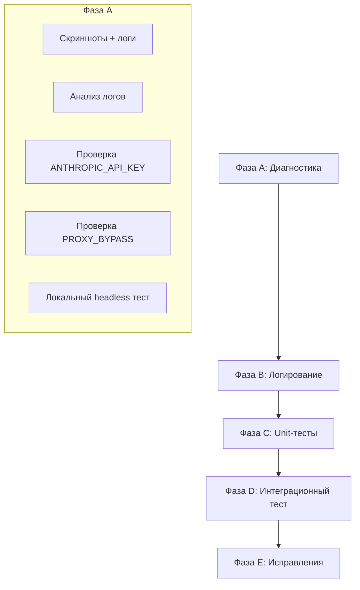

# План: тестирование и отлов причины падения Google Pay popup

## 1. Текущее состояние кода — выявленные недоработки

### 1.1 Отсутствие проверки блокировки Google в `_confirm_payment_in_popup`

**Файл:** [app/core/google_pay.py](app/core/google_pay.py)

`_is_google_block_page()` вызывается только в `_login_google_in_popup`. В `_confirm_payment_in_popup` (строки 2106–2187) проверки нет. Если popup открывается сразу на pay.google.com с блокировкой («This browser may not be secure»), код 20+ секунд ищет кнопку и падает без понятной причины.

**Рекомендация:** Добавить проверку `_is_google_block_page` в начале `_confirm_payment_in_popup` (после скриншота), до вызова `_click_pay_button_once`. При обнаружении — логировать, делать скриншот, возвращать `False`.

---

### 1.2 JS `_js_find_pay_button_rect` не ищет внутри iframe

**Файл:** [app/core/google_pay.py](app/core/google_pay.py), строки 1919–1956

`page.evaluate()` выполняется в main frame. Кнопка на pay.google.com часто внутри iframe — JS её не видит. Порядок вызовов корректен: сначала `_click_pay_button_inside_iframes`, потом Claude, потом JS. Проблема — если iframe не загрузился за отведённое время, fallback (JS) тоже не поможет.

**Рекомендация:** Оставить как есть; приоритет — улучшить iframe-логику и таймауты.

---

### 1.3 Жёстко заданный таймаут `_PAY_PAGE_LOAD_WAIT_MS`

**Файл:** [app/core/google_pay.py](app/core/google_pay.py), строка 1777

```python
_PAY_PAGE_LOAD_WAIT_MS = 20_000  # 20 сек
```

На сервере 20 сек может не хватать (медленная сеть, прокси). Константа не вынесена в конфиг.

**Рекомендация:** Добавить `GOOGLE_PAY_POPUP_LOAD_WAIT_SEC` в [app/config.py](app/config.py) (по умолчанию 25–30), использовать в `google_pay.py`.

---

### 1.4 Слабое логирование при ошибках iframe

**Файл:** [app/core/google_pay.py](app/core/google_pay.py)

В `_click_pay_button_inside_iframes` и `_click_pay_button_once` ошибки логируются через `logger.debug`. При `LOG_LEVEL=INFO` в production эти сообщения не видны.

**Рекомендация:** Ключевые провалы (iframe не найден, селектор не сработал) логировать как `logger.warning` или `logger.info`.

---

### 1.5 Claude fallback при отсутствии ключа

**Файл:** [app/core/google_pay.py](app/core/google_pay.py), строки 272–276

При отсутствии `ANTHROPIC_API_KEY` используется `logger.debug` — в production не видно, что fallback отключён.

**Рекомендация:** Логировать `logger.warning` при отсутствии ключа в момент вызова Claude (или при первом использовании).

---

### 1.6 Worker без Xvfb

**Файл:** [docker-compose.yml](docker-compose.yml)

Worker: `command: arq app.workers.arq_worker.WorkerSettings` — Xvfb не запускается. App: `CMD ["/app/scripts/start_with_xvfb.sh"]` — Xvfb есть. Worker имеет `DISPLAY=:99`, но процесса Xvfb нет. Если заказы идут через worker (Kupikod, Plati и т.д.), headed Chrome не работает.

**Рекомендация:** Запускать worker через обёртку с Xvfb (аналог `start_with_xvfb.sh`) или перевести worker на headless, если это допустимо.

---

## 2. План тестирования и диагностики

### Фаза A: Диагностика (без изменений кода)


| Шаг | Действие                                                                                                                                | Цель                                                                            |
| --- | --------------------------------------------------------------------------------------------------------------------------------------- | ------------------------------------------------------------------------------- |
| A1  | Запустить покупку на сервере, сохранить скриншоты `screenshots/google_pay_confirm_popup.png`, `google_pay_confirm_failed.png`           | Понять, что видит браузер: блокировка Google, пустая страница, форма без кнопки |
| A2  | Проверить логи: `"Вариант 2: iframe"`, `"Кнопка 'Pay' (exact) нажата"`, `"Claude AI"`, `"This browser may not be secure"`               | Определить, на каком этапе падает                                               |
| A3  | Проверить `ANTHROPIC_API_KEY` в `.env` на сервере                                                                                       | Убедиться, что Claude fallback доступен                                         |
| A4  | Проверить `PROXY_BYPASS_GOOGLE` и применение bypass в [app/core/browser_automation.py](app/core/browser_automation.py) (строки 340–350) | Исключить прокси для pay.google.com                                             |
| A5  | Запустить `manual_login_gpay_demo.py` локально с `BROWSER_HEADLESS=true`                                                                | Воспроизвести headless-сценарий                                                 |


---

### Фаза B: Усиление логирования


| Шаг | Действие                                                                                                               | Файл                                             |
| --- | ---------------------------------------------------------------------------------------------------------------------- | ------------------------------------------------ |
| B1  | В начале `_confirm_payment_in_popup`: логировать URL, количество frames, наличие текста блокировки                     | [app/core/google_pay.py](app/core/google_pay.py) |
| B2  | В `_click_pay_button_inside_iframes`: при каждом провале iframe — `logger.info` с селектором и причиной                | [app/core/google_pay.py](app/core/google_pay.py) |
| B3  | В `_click_pay_button_once`: логировать, какой метод сработал (iframe / Claude / JS / locators) или что все провалились | [app/core/google_pay.py](app/core/google_pay.py) |
| B4  | При отсутствии `ANTHROPIC_API_KEY` в `_claude_find_oplatit_button_coordinates` — `logger.warning`                      | [app/core/google_pay.py](app/core/google_pay.py) |


---

### Фаза C: Unit-тесты


| Шаг | Действие                                                                                                                    | Файл                                                 |
| --- | --------------------------------------------------------------------------------------------------------------------------- | ---------------------------------------------------- |
| C1  | Тест `_is_google_block_page`: «This browser or app may not be secure», «Couldn't sign you in» → True; обычный текст → False | [tests/test_google_pay.py](tests/test_google_pay.py) |
| C2  | Тест `_confirm_payment_in_popup` с mock: при блокировке Google — возврат False, скриншот не делается лишний раз             | [tests/test_google_pay.py](tests/test_google_pay.py) |
| C3  | Тест `_click_pay_button_inside_iframes` с mock: pay.fastspring.com → False; pay.google.com + iframe с кнопкой → True        | [tests/test_google_pay.py](tests/test_google_pay.py) |


---

### Фаза D: Интеграционный тест (опционально)


| Шаг | Действие                                                                                                                                                 |
| --- | -------------------------------------------------------------------------------------------------------------------------------------------------------- |
| D1  | Скрипт `scripts/debug_gpay_popup.py`: открыть store → checkout → G Pay → дождаться popup → сделать скриншот + dump frames/URL в лог, без клика по кнопке |
| D2  | Запуск на сервере (Docker) и локально, сравнение скриншотов и логов                                                                                      |


---

### Фаза E: Исправления кода


| Шаг | Действие                                                                   | Приоритет |
| --- | -------------------------------------------------------------------------- | --------- |
| E1  | Добавить проверку `_is_google_block_page` в `_confirm_payment_in_popup`    | Высокий   |
| E2  | Вынести `_PAY_PAGE_LOAD_WAIT_MS` в конфиг `GOOGLE_PAY_POPUP_LOAD_WAIT_SEC` | Средний   |
| E3  | Усилить логирование (фаза B)                                               | Средний   |
| E4  | Worker + Xvfb (если заказы идут через worker)                              | Средний   |


---

## 3. Порядок выполнения




---

## 4. Критерии успеха

- По скриншотам и логам однозначно определяется причина (блокировка / iframe / таймаут / селекторы).
- При блокировке Google — понятное сообщение в логах и `result["error"]`.
- Unit-тесты покрывают `_is_google_block_page` и основные сценарии `_confirm_payment_in_popup` / `_click_pay_button_inside_iframes`.

---

## 5. Рекомендации по усилению решения

Реализованные изменения (E1–E4, C, D1) улучшают диагностику и устойчивость, но не гарантируют устранение причины. Ниже — дополнительные меры в зависимости от выявленной причины.

### 5.1 Сначала получить факты

- Запустить `scripts/debug_gpay_popup.py` на сервере.
- Сохранить скриншоты `gpay_popup_debug.png`, `google_pay_confirm_popup.png`.
- Проверить логи: какой метод последний срабатывает (iframe / Claude / JS / locators).

Без этого дальнейшие шаги — лишь предположения.

### 5.2 Если причина — блокировка Google

- Явно включить Patchright: `BROWSER_USE_PATCHRIGHT=true`, `BROWSER_USE_CHROME=true`.
- Проверить, что `PROXY_BYPASS_GOOGLE` реально применяется (логи при старте браузера).
- Использовать резидентные прокси (Novada res) вместо датацентровых.

### 5.3 Если причина — iframe / селекторы

- Добавить retry с увеличенным ожиданием перед поиском кнопки.
- Расширить список селекторов iframe (Google может менять структуру).
- Добавить fallback: поиск кнопки по `aria-label`, `data-testid` и т.п.

### 5.4 Если причина — сеть / таймауты

- Увеличить таймауты для Claude API (сейчас 25 сек).
- Добавить retry для `_click_pay_button_once` с паузой между попытками.
- Проверить, что pay.google.com не идёт через прокси.

### 5.5 Альтернативные подходы

- Использовать CDP (Chrome DevTools Protocol) для клика, если Playwright не находит элемент.
- Использовать persistent profile, где уже выполнен вход в Google, чтобы уменьшить число шагов.

### 5.6 Порядок действий

1. Запустить `debug_gpay_popup.py` на сервере и собрать скриншоты и логи.
2. По результатам определить причину (блокировка / iframe / таймаут / сеть).
3. Применить соответствующие усиления из разделов 5.2–5.5.

